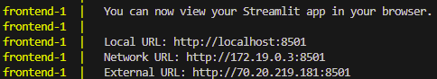
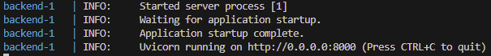
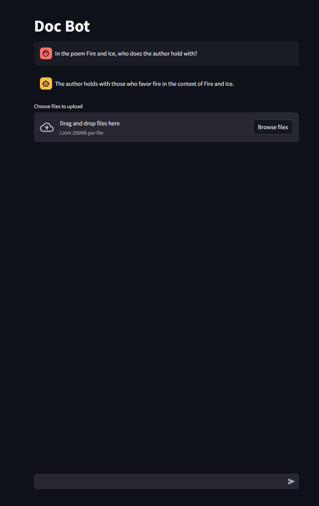
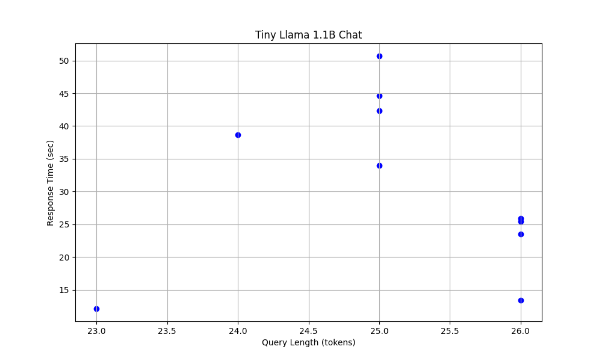
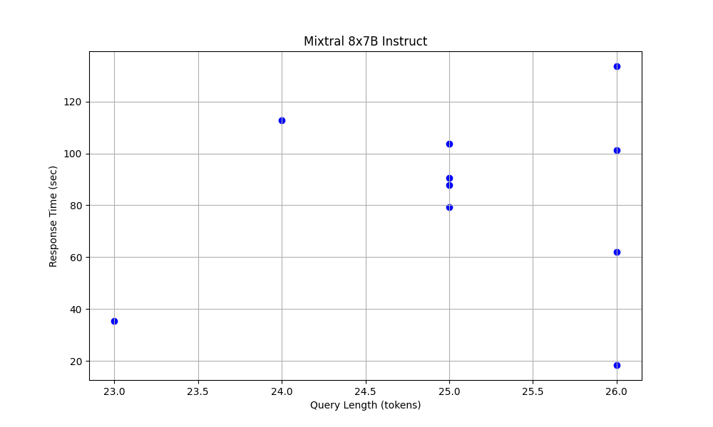
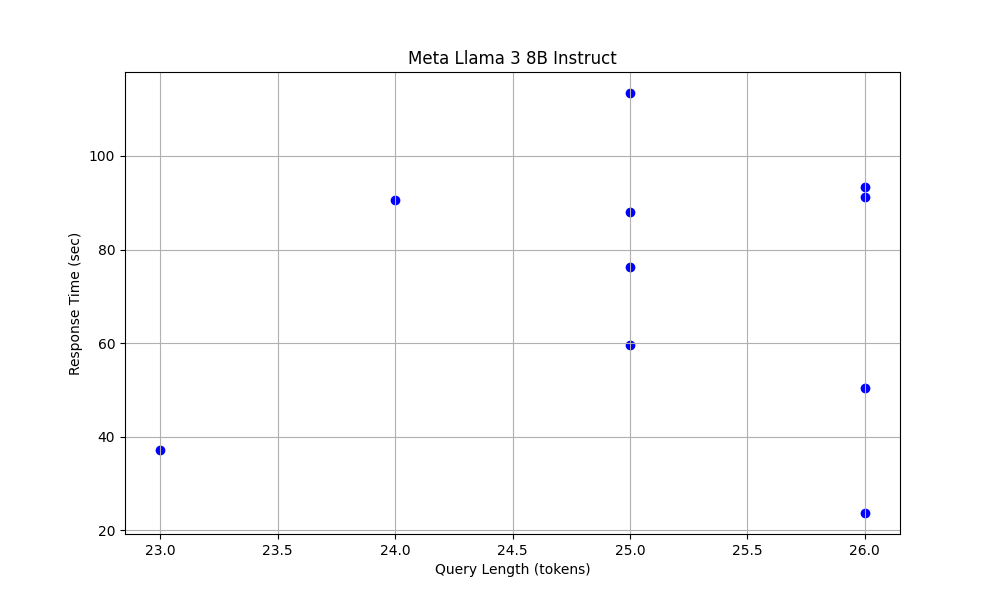

# DocuWhisper
*Christian Hollar (christian.hollar@duke.edu)*

[](https://github.com/christianwhollar/DocuWhisper/actions/workflows/backend-py-ci.yml)
[](https://github.com/christianwhollar/DocuWhisper/actions/workflows/backend-rust-ci.yml)
[](https://github.com/christianwhollar/DocuWhisper/actions/workflows/frontend-py-ci.yml)
[](https://github.com/christianwhollar/DocuWhisper/actions/workflows/docker-image-backend.yml)
[](https://github.com/christianwhollar/DocuWhisper/actions/workflows/docker-image-frontend.yml)

## Table of Contents
- [Project Purpose](#project-purpose)
- [How to Run](#how-to-run)
- [How to Test](#how-to-test)
- [Demo Video](#demo-video)
- [Repository Structure](#repository-structure)
- [Architecture Diagram](#architecture-diagram)
- [Model Evaluation](#model-evaluation)

## Project Purpose
I developed DocuWhisper as part of the AIPI 561: Operationalizing AI (MLOps) course at Duke University (Master of Engineering in Artificial Intelligence). The primary goal of DocuWhisper is to enable users to interact with and query documents in a conversational manner using advanced AI techniques.

### Key Features:
- **Document Interaction**: Users can upload documents and interact with them through a conversational interface.
- **Document Processing**: Each document is split into chunks of three sentences, and embeddings are generated for each chunk.
- **Similarity Search**: Uses Facebook AI Similarity Search (FAISS) to select relevant chunks of text based on embeddings.
- **Data Storage**: Documents and their embeddings are stored in a PostgreSQL database.
- **Containerized Architecture**: The application runs in two Docker containers, one for the frontend and one for the backend.
- **Retrieval Augmented Generation (RAG) Agent**: Utilizes a RAG agent to facilitate document interaction.
- **LlamaFile Integration**: Uses LlamaFile (llamafile.ai) for conversational AI capabilities.
- **CI/CD Pipeline**: 
  - **Formatting**: Code is formatted using Black.
  - **Linting**: Code is linted using Flake8.
  - **Testing**: Unit tests are run using pytest for both the frontend and backend.
  - **Rust Backend**: Builds binary releases for the Rust backend/utils package.
  - **Docker Images**: Builds Docker images for the frontend and backend, which are then pushed to Docker Hub.

The frontend and backend services run as individual containerized applications, allowing for modular and scalable deployment.

## How to Run

1. **Install [Docker](https://docs.docker.com/engine/install/)**

2. **Make a Hugging Face API Key:**
    - Go to the [Hugging Face website](https://huggingface.co/join) and create an account if you don't have one.
    - Once logged in, go to your [API tokens page](https://huggingface.co/settings/tokens).
    - Create a new API token and save it for later use.

3. **Clone the DocuWhisper Repository and Enter the Directory:**
    ```sh
    git clone https://github.com/christianwhollar/DocuWhisper
    cd ./DocuWhisper
    ```

4. **Install PostgreSQL:**
    Follow the [PostgreSQL installation instructions](https://www.postgresql.org/download/).

    Then run the following commands to start PostgreSQL and set up the database:
    ```sh
    sudo service postgresql start
    sudo -i -u postgres
    psql
    CREATE DATABASE mydatabase;
    CREATE USER myuser WITH PASSWORD 'mypassword';
    GRANT ALL PRIVILEGES ON DATABASE mydatabase TO myuser;
    ```

5. **Create `backend/.env` File:**
    Create a file named `.env` in the `backend` directory with the following content:
    ```
    ENV='development'
    HUGGINGFACE_API_KEY=HUGGINGFACE_API_KEY
    DB_NAME=mydatabase
    DB_USER=myuser
    DB_PASSWORD=mypassword
    DB_HOST=localhost
    DB_PORT=5432
    ```

6. **Download and Set Up the Llama File:**
    Run the following commands to download the Llama file and run it:
    ```sh
    mkdir -p backend/models
    curl -L -o backend/models/Meta-Llama-3-8B-Instruct.Q5_K_M.llamafile "https://huggingface.co/Mozilla/Meta-Llama-3-8B-Instruct-llamafile/resolve/main/Meta-Llama-3-8B-Instruct.Q5_K_M.llamafile?download=true"
    chmod +x backend/models/Meta-Llama-3-8B-Instruct.Q5_K_M.llamafile
    ./backend/models/Meta-Llama-3-8B-Instruct.Q5_K_M.llamafile
    ```

7. **Start the Docker Containers:**
    ```sh
    docker-compose up
    ```

8. **Access the Frontend:**
    Open your browser and navigate to [http://localhost:8501](http://localhost:8501) to enter the frontend.

After running ```docker-compose up```:

Frontend Status:



Backend Status:



Frontend Interface Example:

<div style="text-align: center;">
  
</div>

## How to Test

Tests are already run as part of the CI/CD pipeline. For local testing, follow these steps:

1. Navigate to the backend directory and run tests:
   ```sh
   cd ./backend
   pytest
   ```

2. Navigate to the frontend directory and run tests:
   ```sh
   cd ./frontend
   pytest
   ```

## Demo Video
The demo is available [here](https://duke.box.com/s/fr5hcdu9h20c9ulwbz3kosnypmv2brzw).

## Repository Structure
### Base
```
/DocuWhisper/                   <- Root folder for the DocuWhisper project
├── frontend/                   <- Frontend folder containing all frontend-related files and folders
├── backend/                    <- Backend folder containing all backend-related files and folders
├── .gitignore                  <- Git ignore file
├── .dockerignore               <- Docker ignore file
├── .flake8                     <- Flake8 configuration file
├── docker-compose.yml          <- Docker Compose configuration file
├── Dockerfile.backend          <- Dockerfile for building the backend container
├── Dockerfile.frontend         <- Dockerfile for building the frontend container
├── pyproject.toml              <- Pyproject.toml file, including Black package configuration
├── requirements.txt            <- Python package dependencies file
└── .github/workflows/          <- GitHub Actions workflow files
    ├── backend-py-ci.yml       <- Continuous Integration workflow for backend Python code
    ├── backend-rust-ci.yml     <- Continuous Integration workflow for backend Rust code
    ├── frontend-py-ci.yml      <- Continuous Integration workflow for frontend Python code
    ├── docker-image-backend.yml<- Workflow for building Docker image for the backend
    └── docker-image-frontend.yml<- Workflow for building Docker image for the frontend
```

### Backend
```
├── backend/                          <- Backend folder containing all backend-related files and folders
│   ├── config/                       <- Configuration files for different environments
│   │   ├── config.development.toml   <- Development configuration file
│   │   └── config.test.toml          <- Test configuration file
│   ├── src/                          <- Source code for the backend
│   │   ├── __init__.py               <- Initialization file for the src module
│   │   ├── document_loader.py        <- Script to load titles and documents from the PostgreSQL database
│   │   ├── embeddings.py             <- Script to chunk documents, generate embeddings for documents and queries, and save to PostgreSQL database
│   │   ├── initialize.py             <- Script to initialize the RAG Agent
│   │   ├── llm.py                    <- Script to handle requests to Llama models
│   │   ├── rag_agent.py              <- Main script for the RAG Agent
│   │   ├── retriever.py              <- Script to retrieve query embeddings and relevant document chunks
│   │   └── vector_store.py           <- Script to store document chunks and embeddings
│   ├── tests/                        <- Folder containing pytest tests
│   │   ├── test_eval.py              <- Tests for generating RAG agent evaluation metrics
│   │   ├── test_document_loader.py   <- Tests for document_loader.py
│   │   ├── test_embeddings.py        <- Tests for embeddings.py
│   │   ├── test_llm.py               <- Tests for llm.py
│   │   ├── test_rag_agent.py         <- Tests for rag_agent.py
│   │   ├── test_retriever.py         <- Tests for retriever.py
│   │   ├── test_vector_store.py      <- Tests for vector_store.py
│   │   └── test_data/                <- Folder for storing test data files
│   │       ├── chunks/               <- Folder for storing test document chunks
│   │       ├── embeddings/           <- Folder for storing test embeddings
│   │       ├── test_embeddings/      <- Folder for storing comparison embeddings used in tests
│   │       └── utils/                <- Folder for pytest utility scripts
│   ├── models/                       <- Folder for storing Llama model files (ignored from repository)
│   │   └── models.json               <- File containing names and links of compatible Llama models
│   ├── utils/                        <- Folder for utility scripts
│   │   └── src/                      <- Source folder for utility scripts
│   │       └── main.rs               <- Script to download documents from a URL and store them in data/test
│   ├── data/                         <- Folder for local document testing storage
│   │   └── test/                     <- Folder for storing test documents
│   │       ├── chunks/               <- Folder for storing test document chunks
│   │       ├── embeddings/           <- Folder for storing test embeddings
│   │       └── .txt                  <- Folder for storing test text files
│   ├── evals/                        <- Folder for .json evaluation files
│   ├── conftest.py                   <- Configuration file for pytest
│   ├── console.py                    <- Script for backend interaction via command line
│   └── main.py                       <- Script to run FastAPI/Uvicorn backend server
```
## Frontend
```
frontend/                       <- Frontend folder containing all frontend-related files and folders
├── app.py                      <- Main script for the Streamlit app
├── utils.py                    <- Utility scripts for the frontend
├── conftest.py                 <- Configuration file for pytest
├── tests/                      <- Folder containing pytest tests for the frontend
│   ├── test_app.py             <- Tests for app.py
│   ├── test_utils.py           <- Tests for utils.py
```

## Architecture Diagram 


## Model Evaluation
- **TinyLlama-1.1B-Chat**
    * Average Latency (sec): 31.075957465171815
    * Output Speed (tokens/sec): 7.165166254743335
    * Response Time vs. Query Length:

    

- **Mixtral-8x7B-Instruct**
    * Average Latency (sec): 82.52777495384217
    * Output Speed (tokens/sec): 3.3496574519228064
    * Response Time vs. Query Length:

    

- **Meta-Llama-3-8B-Instruct**
    * Preferred: Balance between average latency, output speed, and quality of answer.
    * Average Latency (sec): 72.35672855377197
    * Output Speed (tokens/sec): 3.271704275654538

    